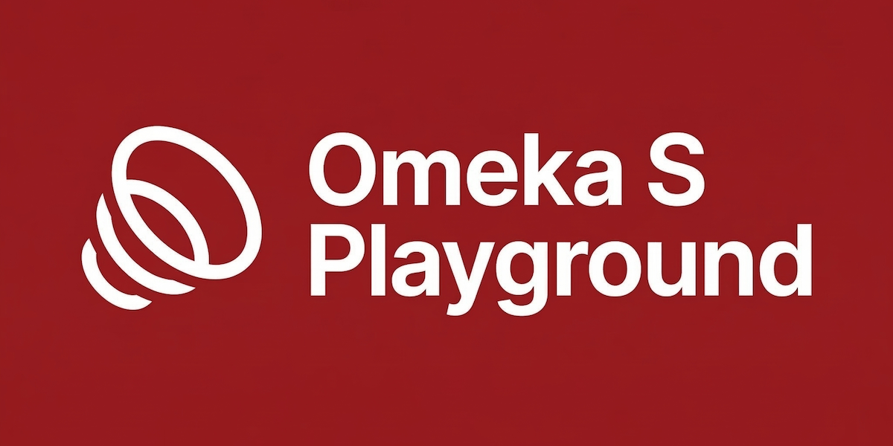

# Omeka S Playground

<p align="center">
  
</p>

[Live demo](https://ateeducacion.github.io/omeka-s-playground/) · [Documentation](docs/) · [Blueprints](docs/blueprint-json.md)

> Run a full Omeka S site in the browser — no server required.

Omeka S Playground runs [Omeka S](https://omeka.org/s/) entirely in the browser using WebAssembly, powered by [WordPress Playground](https://github.com/WordPress/wordpress-playground)'s `@php-wasm/web` runtime. Every page load boots a fresh Omeka S instance — nothing is stored on disk and nothing leaves your browser.

## Getting Started

### Try it online

Open the [live demo](https://ateeducacion.github.io/omeka-s-playground/) — no install needed.

### Run it locally

```bash
git clone https://github.com/ateeducacion/omeka-s-playground.git
cd omeka-s-playground
make up
```

Then open <http://localhost:8080>.

### Prerequisites

- Node.js 18+
- npm
- Composer
- Git

## How It Works

```text
index.html          Shell UI (toolbar, address bar, log panel)
  └─ remote.html    Runtime host — registers the Service Worker
       ├─ sw.js     Intercepts requests → routes to PHP worker
       └─ php-worker.js (bundled via esbuild)
            └─ @php-wasm/web (WebAssembly, PHP 8.1–8.5)
                 ├─ Omeka core in writable MEMFS  (extracted from ZIP bundle)
                 └─ In-memory state                (SQLite + config + files in MEMFS)
```

1. The shell boots a scoped runtime host inside an iframe.
2. The Service Worker intercepts all requests under `/playground/<scope>/<runtime>/…`.
3. The PHP worker extracts the Omeka ZIP bundle into writable MEMFS.
4. Omeka runs against an in-memory SQLite database — fully ephemeral, no persistence.
5. If the PHP runtime crashes (WASM OOM / file descriptor exhaustion), the worker snapshots the DB and addon files, boots a fresh runtime, and restores state automatically.

**Default credentials:** `admin@example.com` / `password` (configurable in [`playground.config.json`](playground.config.json)).

### No persistence by design

All state lives in memory (Emscripten MEMFS). Closing the tab destroys everything. This is intentional — the playground is meant for exploration, demos, and testing, not for storing data.

### PHP version selection

The settings panel (⚙️ icon) lets you switch between PHP 8.1, 8.2, 8.3 (default), 8.4, and 8.5. Changing PHP version resets the playground to a clean install.

### Make targets

| Command | Description |
|---------|-------------|
| `make up` | Install deps, build the Omeka bundle, and serve locally |
| `make prepare` | Install npm deps, vendor browser assets, and bundle the PHP worker |
| `make bundle` | Fetch Omeka, run Composer, build the ZIP bundle and manifest |
| `make serve` | Start the local dev server on port 8080, including the addon download proxy |
| `make test` | Run unit tests |
| `make lint` | Check code with Biome |
| `make format` | Auto-fix code with Biome |
| `make clean` | Remove generated bundle, dist, and vendored runtime assets |

---

## Blueprints

Blueprints are JSON files that describe the desired state of a playground instance — similar to [WordPress Playground Blueprints](https://wordpress.github.io/wordpress-playground/blueprints/).

A default blueprint is bundled at [`assets/blueprints/default.blueprint.json`](assets/blueprints/default.blueprint.json). You can override it by:

- Passing `?blueprint=/path/to/file.json` in the URL.
- Passing `?blueprint-data=...` in the URL with a base64url-encoded UTF-8 JSON blueprint payload.
- Importing a `.json` file from the toolbar.

### What blueprints can configure

- Landing page, installation title, locale, and timezone
- Debug mode for Omeka/PHP error visibility
- Admin and additional users
- A default site with a theme selection
- Item sets and items with remote media
- Module installation/activation from bundled addons, direct ZIP URLs, or `omeka.org` slugs
- Theme installation from bundled addons, direct ZIP URLs, or `omeka.org` slugs

### Example

```json
{
  "$schema": "./assets/blueprints/blueprint-schema.json",
  "debug": { "enabled": true },
  "landingPage": "/s/demo",
  "siteOptions": {
    "title": "Demo Omeka",
    "locale": "es",
    "timezone": "Atlantic/Canary"
  },
  "users": [
    { "username": "admin", "email": "admin@example.com", "password": "password", "role": "global_admin" }
  ],
  "modules": [
    { "name": "CSVImport", "state": "activate" },
    {
      "name": "Mapping",
      "state": "activate",
      "source": { "type": "url", "url": "https://example.com/Mapping.zip" }
    }
  ],
  "itemSets": [{ "title": "Demo Collection" }],
  "items": [
    {
      "title": "Landscape sample",
      "itemSets": ["Demo Collection"],
      "media": [{ "type": "url", "url": "https://example.com/photo.jpg", "title": "Photo" }]
    }
  ],
  "site": {
    "title": "Demo Site",
    "slug": "demo",
    "theme": "default",
    "setAsDefault": true
  }
}
```

The full schema is at [`assets/blueprints/blueprint-schema.json`](assets/blueprints/blueprint-schema.json).

---

## Key Technologies

| Technology | Role |
|-----------|------|
| [@php-wasm/web](https://github.com/WordPress/wordpress-playground) | PHP 8.1–8.5 compiled to WebAssembly (WordPress Playground runtime) |
| [Omeka S](https://omeka.org/s/) (SQLite branch) | The digital collections platform being served |
| [Service Workers](https://developer.mozilla.org/en-US/docs/Web/API/Service_Worker_API) | Intercept HTTP requests and route them to the WASM runtime |
| [esbuild](https://esbuild.github.io/) | Bundles the PHP worker and @php-wasm dependencies |
| [fflate](https://github.com/101arrowz/fflate) | ZIP extraction for the Omeka core bundle |

The Omeka source is built from the [`feature/experimental-sqlite-support`](https://github.com/ateeducacion/omeka-s/tree/feature/experimental-sqlite-support) branch of [ateeducacion/omeka-s](https://github.com/ateeducacion/omeka-s).

---

## Known Limitations

- Remote addon installation only supports ZIP packages that are already ready to run in Omeka. Releases that require Composer, Node builds, or extra post-install steps are not supported in-browser.
- `omeka.org` slug resolution depends on the current HTML download links on omeka.org.
- Remote ZIP downloads need a proxy endpoint when the upstream host does not expose CORS headers.
- PHP outbound HTTP is limited by the configured `outboundHttp.allowedHosts` and `allowedMethods`.
- Browser compatibility is focused on Chromium; Firefox and Safari may need additional validation.
- All state is ephemeral — closing the tab destroys everything.

---

## Prior Art

- [WordPress Playground](https://github.com/WordPress/wordpress-playground) — the original inspiration for running a PHP CMS entirely in the browser.
- [Moodle Playground](https://github.com/ateeducacion/moodle-playground) — sister project running Moodle in the browser with the same architecture.

---

## Contributing

Contributions are welcome. [Open an issue](https://github.com/ateeducacion/omeka-s-playground/issues) or submit a pull request.

## License

See the repository for license details.
